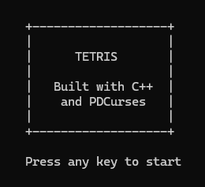
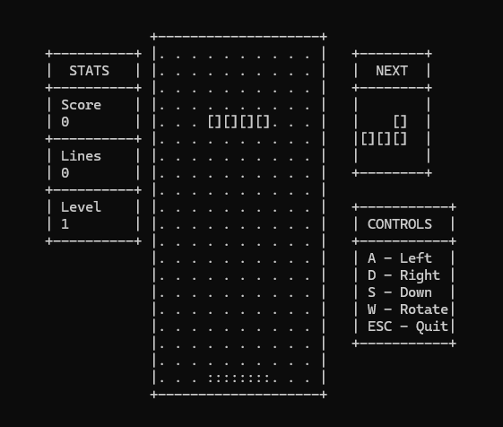

# Tetris

A terminal-based Tetris game built with C++ and PDCurses.

## Preview

### Title Screen

### Gameplay

## Features

- All 7 classic Tetris pieces
- Ghost piece showing where the current piece will land
- Next piece preview
- Score, lines and level tracking
- Multi-line clear scoring bonus
- Game over detection

## Scoring

| Lines Cleared | Points |
|---|---|
| 1 line | 100 x level |
| 2 lines | 300 x level |
| 3 lines | 500 x level |
| 4 lines | 800 x level |

## Controls

| Key | Action |
|---|---|
| A | Move left |
| D | Move right |
| S | Move down |
| W | Rotate |
| ESC | Quit |

## Built With

- C++
- PDCurses

## How to Run

1. Clone the repository
   git clone https://github.com/xtekkis/tetris.git
2. Open tetris.sln in Visual Studio 2022
3. Build and run with Ctrl + F5